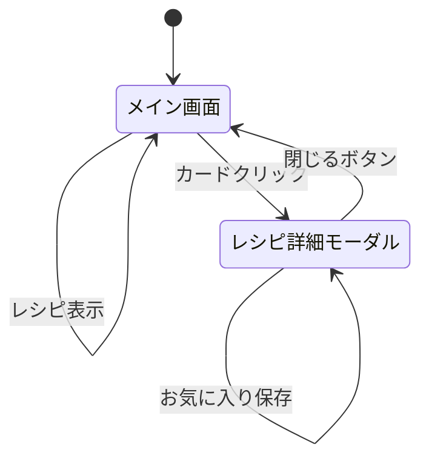

# システム仕様書

## 1. 機能要件

### 1.1 機能一覧

| 機能ID | 機能名 | 優先度 | 説明 |
|--------|--------|--------|------|
| F-001 | 食材入力機能 | 必須 | 残り物・食材をテキストで入力 |
| F-002 | オプション設定 | 必須 | 難易度・調理時間の設定 |
| F-003 | レシピ生成機能 | 必須 | Gemini APIでレシピを3つ生成 |
| F-004 | レシピ一覧表示 | 必須 | 生成されたレシピをカード形式で表示 |
| F-005 | レシピ詳細表示 | 必須 | モーダルで手順・材料を詳細表示 |
| F-006 | お気に入り保存 | 必須 | LocalStorageにレシピを保存 |
| F-007 | ローディング表示 | 必須 | 生成中の待機状態を表示 |
| F-008 | エラーハンドリング | 必須 | 入力エラー・API制限のエラー表示 |
| F-009 | レスポンシブ対応 | 必須 | モバイル・タブレット・デスクトップ対応 |
| F-010 | 入力例表示 | 推奨 | ワンクリックで入力例を設定 |

### 1.2 機能詳細

#### F-001: 食材入力機能
**概要**: ユーザーが残り物や食材を入力する

**入力仕様**:
- テキストエリア形式
- カンマ区切りまたは全角カンマ区切り
- 複数行対応
- 最小1つ、最大10個程度

**入力例**:
```
残りカレー, ご飯, チーズ
```

**バリデーション**:
- 空文字チェック
- 最小1つの食材が必要

---

#### F-002: オプション設定
**概要**: レシピ生成の条件を設定

**設定項目**:

| 項目 | 種類 | 初期値 | 選択肢 |
|------|------|--------|--------|
| 難易度 | セレクトボックス | かんたん | すごくかんたん・かんたん・ふつう・むずかしい |
| 調理時間 | レンジスライダー | 15分 | 5分〜60分（5分刻み） |

**UI仕様**:
- `<details>` 要素で折りたたみ可能
- デフォルトは閉じた状態

---

#### F-003: レシピ生成機能
**概要**: Gemini APIを使用してレシピを生成

**API仕様**:
- **エンドポイント**: `POST /api/generate-recipe`
- **リクエスト形式**:
```json
{
  "ingredients": ["残りカレー", "ご飯", "チーズ"],
  "preferences": {
    "difficulty": "easy",
    "time": 30
  }
}
```

- **レスポンス形式**:
```json
{
  "recipes": [
    {
      "title": "カレードリア",
      "description": "チーズたっぷりの簡単アレンジ",
      "difficulty": "かんたん",
      "cookingTime": 15,
      "additionalIngredients": ["バター", "パセリ"],
      "steps": [
        "耐熱皿にご飯を敷く",
        "残りカレーをかける",
        "チーズをのせて200度で10分焼く"
      ],
      "tips": "チーズは2種類混ぜると風味豊かに"
    }
  ],
  "generatedAt": "2025-01-XX T12:34:56Z"
}
```

**Gemini API設定**:
- **モデル**: `gemini-2.5-flash`
- **Temperature**: 0.7（創造性とバランス）
- **MaxOutputTokens**: 4096

**レート制限**:
- 無料Gemini API: 15 RPM
- アプリ側制限: 5 RPM（1分間に5回まで）
- 制限超過時: 429エラー返却

---

#### F-004: レシピ一覧表示
**概要**: 生成された3つのレシピをカード形式で表示

**カード表示項目**:
- レシピタイトル
- 一言説明
- 難易度バッジ
- 調理時間アイコン
- 追加食材タグ（最大3つ）
- 「詳細を見る」ボタン

**レイアウト**:
- デスクトップ: 3カラムグリッド
- タブレット: 2カラムグリッド
- モバイル: 1カラム

---

#### F-005: レシピ詳細表示
**概要**: モーダルウィンドウでレシピ詳細を表示

**表示項目**:
- レシピタイトル
- 説明
- 難易度・調理時間バッジ
- 追加で必要な食材リスト
- 作り方（番号付きリスト）
- ワンポイントアドバイス
- お気に入り保存ボタン
- 閉じるボタン

**UI仕様**:
- 全画面オーバーレイ
- 背景クリックで閉じる
- スクロール対応
- レスポンシブ（モバイルは全画面）

---

#### F-006: お気に入り保存
**概要**: 気に入ったレシピをLocalStorageに保存

**保存仕様**:
- ストレージキー: `favoriteRecipes`
- データ形式: JSON配列
- 保存上限: なし（ブラウザ制限まで）

**保存内容**:
```json
[
  {
    "title": "カレードリア",
    "description": "...",
    "savedAt": "2025-01-XX T12:34:56Z",
    ...
  }
]
```

**UI**:
- 保存成功時: アラート表示「お気に入りに保存しました！」
- 重複チェック: なし（同じレシピでも複数保存可能）

---

#### F-007: ローディング表示
**概要**: API呼び出し中の待機状態を表示

**表示内容**:
- スピナーアニメーション
- テキスト: "レシピを考えています..."

**表示タイミング**:
- 生成ボタンクリック〜レスポンス受信まで
- ボタン無効化

---

#### F-008: エラーハンドリング
**概要**: エラー発生時にユーザーフレンドリーなメッセージを表示

**エラー種別**:

| HTTPステータス | エラー内容 | 表示メッセージ |
|---------------|-----------|---------------|
| 400 | 入力パラメータ不正 | "食材を入力してください" |
| 429 | レート制限超過 | "リクエストが多すぎます。1分後に再試行してください" |
| 500 | サーバーエラー | "サーバーエラーが発生しました。しばらくしてから再試行してください" |
| その他 | 予期しないエラー | "予期しないエラーが発生しました" |

**UI表示**:
- 赤色の警告ボックス
- 入力フォームの下に表示
- 自動で消えない（ユーザーアクションで再生成時にクリア）

---

#### F-009: レスポンシブ対応
**概要**: あらゆるデバイスで快適に使える

**対応デバイス**:
- **モバイル**: 320px〜767px
- **タブレット**: 768px〜1023px
- **デスクトップ**: 1024px以上

**ブレークポイント**（Tailwind CSS標準）:
```
sm: 640px
md: 768px
lg: 1024px
xl: 1280px
```

---

#### F-010: 入力例表示
**概要**: ワンクリックで入力例を設定

**入力例**:
```
残りカレー, ご飯, チーズ
```

**UI**:
- テキストリンク形式
- テキスト: "入力例を使う"
- クリックで入力フィールドに自動入力

---

## 2. 非機能要件

### 2.1 性能要件

| 項目 | 要件 |
|------|------|
| レスポンスタイム | Gemini API呼び出し: 5秒以内 |
| 同時接続数 | 特に制限なし（Vercel制限に準拠） |
| 可用性 | 99%（Vercel SLA） |

### 2.2 セキュリティ要件

| 項目 | 対策 |
|------|------|
| API Key管理 | 環境変数で管理（`.env.local`、Vercel環境変数） |
| API Key露出防止 | バックエンド（API Routes）でのみ使用 |
| CORS | Next.js標準のセキュリティ設定 |
| XSS対策 | React標準のエスケープ処理 |
| 入力値検証 | サーバーサイドでバリデーション |

### 2.3 ユーザビリティ要件

| 項目 | 要件 |
|------|------|
| アクセシビリティ | WCAG 2.1 AA準拠を目指す |
| 言語 | 日本語のみ |
| ブラウザ対応 | Chrome, Firefox, Safari, Edge 最新版 |
| フォント | 游ゴシック / Noto Sans JP |

### 2.4 保守性要件

| 項目 | 要件 |
|------|------|
| コード品質 | TypeScriptで型安全性を確保 |
| ドキュメント | README.md、仕様書（product.md, spec.md）を整備 |
| バージョン管理 | Git/GitHubで管理 |
| CI/CD | Vercel自動デプロイ |

---

## 3. データ仕様

### 3.1 データモデル

#### Recipe型
```typescript
interface Recipe {
  id?: string;                    // オプション（フロント生成）
  title: string;                  // レシピ名
  description: string;            // 一言説明（30文字以内）
  difficulty: 'すごくかんたん' | 'かんたん' | 'ふつう' | 'むずかしい';  // 難易度
  cookingTime: number;            // 調理時間（分）
  additionalIngredients: string[]; // 追加食材リスト
  steps: string[];                // 手順リスト
  tips: string;                   // コツ・アドバイス
}
```

#### RecipeRequest型
```typescript
interface RecipeRequest {
  ingredients: string[];          // 入力食材
  preferences?: {
    difficulty?: 'very_easy' | 'easy' | 'medium' | 'hard';
    time?: number;                // 調理時間上限（分）
  };
}
```

#### RecipeResponse型
```typescript
interface RecipeResponse {
  recipes: Recipe[];              // レシピ配列（3つ）
  generatedAt: string;            // 生成日時（ISO8601）
}
```

### 3.2 LocalStorage仕様

**キー**: `favoriteRecipes`

**値**:
```json
[
  {
    "id": "recipe-1",
    "title": "カレードリア",
    "description": "チーズたっぷりの簡単アレンジ",
    "difficulty": "かんたん",
    "cookingTime": 15,
    "additionalIngredients": ["バター", "パセリ"],
    "steps": ["..."],
    "tips": "...",
    "savedAt": "2025-01-XX T12:34:56Z"
  }
]
```

---

## 4. 画面仕様

### 4.1 画面一覧

| 画面ID | 画面名 | 説明 |
|--------|--------|------|
| P-001 | メイン画面 | 食材入力〜レシピ一覧表示 |
| P-002 | レシピ詳細モーダル | レシピの詳細情報表示 |

### 4.2 画面遷移図



---

## 5. API仕様

### 5.1 エンドポイント一覧

| メソッド | パス | 説明 |
|---------|------|------|
| POST | `/api/generate-recipe` | レシピ生成 |

### 5.2 POST /api/generate-recipe

**概要**: 入力食材からレシピを生成

**リクエスト**:
```json
{
  "ingredients": ["残りカレー", "ご飯", "チーズ"],
  "preferences": {
    "difficulty": "easy",
    "time": 30
  }
}
```

**レスポンス（成功）**:
```json
{
  "recipes": [
    {
      "title": "カレードリア",
      "description": "チーズたっぷりの簡単アレンジ",
      "difficulty": " かんたん",
      "cookingTime": 15,
      "additionalIngredients": ["バター", "パセリ"],
      "steps": [
        "耐熱皿にご飯を敷く",
        "残りカレーをかける",
        "チーズをのせて200度で10分焼く"
      ],
      "tips": "チーズは2種類混ぜると風味豊かに"
    }
  ],
  "generatedAt": "2025-01-XX T12:34:56.789Z"
}
```

**レスポンス（エラー）**:
```json
{
  "error": "エラーメッセージ"
}
```

**ステータスコード**:
- `200`: 成功
- `400`: 不正なリクエスト
- `429`: レート制限超過
- `500`: サーバーエラー

---

## 6. Gemini APIプロンプト仕様

### 6.1 プロンプトテンプレート

```
あなたはプロの料理研究家です。
以下の残り物・食材から、創造的で実用的なアレンジレシピを3つ提案してください。

# 入力食材
{ingredients}

# 条件
- 難易度: {difficulty}
- 調理時間: {time}分以内
- 家庭にある調味料は自由に使用可能

# 出力形式（JSON）
以下のJSON形式で回答してください:
{
  "recipes": [
    {
      "title": "レシピ名",
      "description": "一言説明（30文字以内）",
      "difficulty": "かんたん",
      "cookingTime": 15,
      "additionalIngredients": ["追加食材1", "追加食材2"],
      "steps": ["手順1", "手順2", "手順3"],
      "tips": "美味しく作るコツ"
    }
  ]
}

# 制約
- 追加食材は最大3つまで
- 手順は5ステップ以内
- 実現可能性を重視
- 必ずJSONのみを返してください。他のテキストは含めないでください。
```

### 6.2 プロンプトパラメータ

| パラメータ | 説明 | 例 |
|-----------|------|-----|
| `{ingredients}` | 入力食材（カンマ区切り） | "残りカレー, ご飯, チーズ" |
| `{difficulty}` | 難易度 | "very_easy", "easy", "medium", "hard" |
| `{time}` | 調理時間上限 | 30 |

### 6.3 Gemini API設定

```typescript
{
  model: "gemini-2.5-flash",
  generationConfig: {
    temperature: 0.7,
    maxOutputTokens: 4096,
  }
}
```

---

## 7. デプロイ仕様

### 7.1 デプロイ環境

**プラットフォーム**: Vercel

**URL**: `https://recipe-arranger.vercel.app`（自動生成）

### 7.2 環境変数

| 変数名 | 説明 | 設定場所 |
|--------|------|----------|
| `GEMINI_API_KEY` | Gemini APIキー | Vercel Dashboard |

### 7.3 デプロイ手順

1. GitHubリポジトリにプッシュ
2. Vercelでプロジェクトをインポート
3. 環境変数 `GEMINI_API_KEY` を設定
4. 自動デプロイ実行

