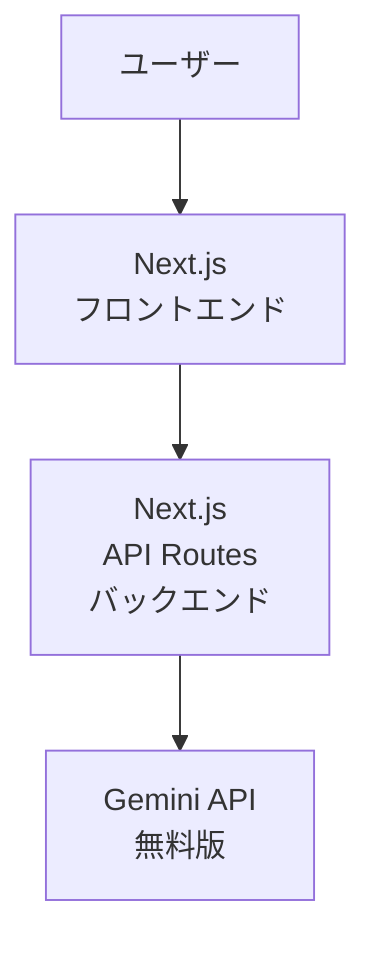

<!-- _class: title -->

# ちょい足しアレンジレシピアプリ

## 「AI 活用によるプログラミング業務効率化」研修 最終課題

{{AUTHOR}}

---

<!-- _class: standard -->

## 作成したアプリの紹介

### ちょい足しアレンジレシピアプリ

**コンセプト**: 「冷蔵庫の残り物が、プロ級の一品に変身！」

残り物の食材や料理を入力すると、Google Gemini APIがアレンジレシピを3つ提案するWebアプリケーション

---

## アプリの主な機能

1. **食材入力**
   - カンマ区切りで残り物を入力

2. **AI分析**
   - Gemini APIが3つのレシピを自動生成
   - 難易度・調理時間・追加食材を表示

3. **結果表示**
   - レシピカード形式で一覧表示
   - 詳細表示（手順・材料・コツ）
   - お気に入り保存（LocalStorage）

---

## 技術スタック

| 分類 | 技術 |
|------|------|
| **フレームワーク** | Next.js 16 (App Router) |
| **言語** | TypeScript 5 |
| **スタイリング** | Tailwind CSS 4 |
| **AI API** | Google Gemini API (gemini-2.5-flash) |
| **デプロイ** | Vercel |
| **開発環境** | Cursor |

---

## システム構成

シンプルな構成で、Next.jsのAPI RoutesからGemini APIを呼び出し

---

## 開発手法

### 仕様駆動開発を意識

- **事前にドキュメントを作成**
  - プロダクト概要（product.md）
  - システム仕様書（spec.md）

- **仕様書を参照しながら実装**
  - 機能要件を明確化
  - API仕様を定義
  - データモデルを設計

- **Spec Kitにもチャレンジ**
  - 使い方をしっかり学んでから再挑戦したい

---

## 実装のポイント

### 1. Gemini APIの活用

- **モデル**: `gemini-2.5-flash`（無料版）
- **JSON Schema**: レスポンス形式を厳密に定義
- **レート制限**: アプリ側で5 RPMに制限

### 2. 型安全性の確保

- TypeScriptで型定義
- リクエスト・レスポンスの型を明確化

### 3. エラーハンドリング

- 入力バリデーション
- API制限の適切な処理
- ユーザーフレンドリーなエラーメッセージ

---

## デモ

### デプロイ環境

**URL**: https://recipe-arranger-ghxd6yy20-tsukasa394s-projects.vercel.app

Vercelにデプロイし、実際に動作する環境を公開

---

## デモ画面

<!-- スクリーンショットを配置する場合は以下を使用 -->
<!--  -->

**主要機能**:
- 食材入力フォーム
- レシピ生成結果のカード表示
- レシピ詳細モーダル

実際にアクセスして動作を確認できます

---

## 苦労した点・学び

### 技術的な課題

- **Gemini APIライブラリの新しさ**
  - `@google/genai` が新しいライブラリ
  - Cursorが最新ライブラリを認識してくれず大変だった
  - ドキュメントを参照しながら実装

---

## 苦労した点・学び

### AIとの協働方法

- **AIに任せすぎると暴走**
  - プログラムを破壊する可能性
  - 細分化して適切に指示
  - 伴走的に作業を見守る必要がある

- **デバッグの注意点**
  - テスト用ソースコードに間違いがあるのに
  - テスト結果が誤っていると勘違い
  - ソースコードに改悪を繰り返した

---

## 動機・背景

### なぜこのアプリを作ったか

1. **生成AIを活用したアプリが作りたかった**
   - せっかくの機会なので最新技術を試したい

2. **バックエンドが動く環境を公開したかった**
   - 現地参加でデモができないため
   - 実際に動作する環境を提供

3. **仕様駆動開発を実践したかった**
   - ドキュメントを先に作成
   - 仕様書を参照しながら実装

---

## 今後の展望

### 追加したい機能

1. **お気に入り機能の拡張**
   - 現在はLocalStorageのみ
   - サーバーサイドでの保存も検討

2. **写真判定機能**
   - 残り物の写真をアップロード
   - AIが食材を認識してレシピを提案

3. **レシピの共有機能**
   - 生成したレシピをSNSで共有

---

## まとめ

### 成果

- **3時間で完成**
  - Cursor研修の最終課題を達成
  - 仕様駆動開発を意識した開発

- **実際に動作するアプリ**
  - Vercelにデプロイ済み
  - 誰でもアクセス可能

- **ドキュメントを整備**
  - プロダクト概要
  - システム仕様書
  - README

---

## まとめ

### 学び

- **AIとの協働方法**
  - 適切な指示の出し方
  - 伴走的な作業の見守り

- **仕様駆動開発の重要性**
  - 事前に仕様を明確化
  - ドキュメントの価値

- **最新技術への挑戦**
  - Gemini APIの活用
  - 実践的な経験

---

## ご清聴ありがとうございました

**質問・フィードバックをお待ちしています**

---

