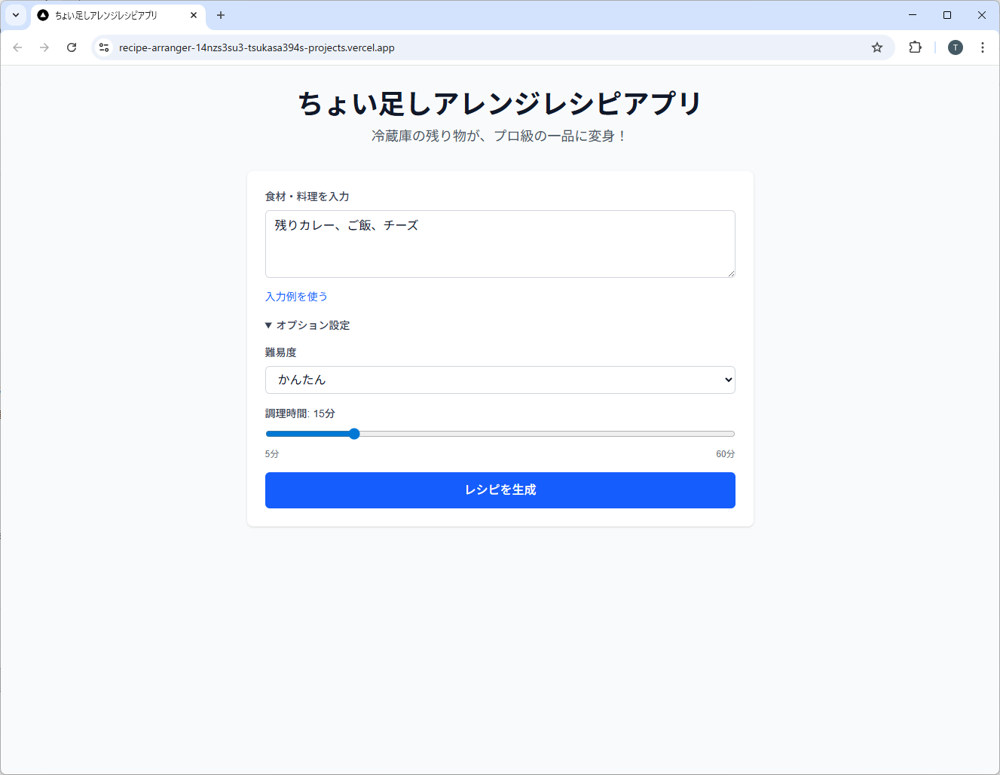
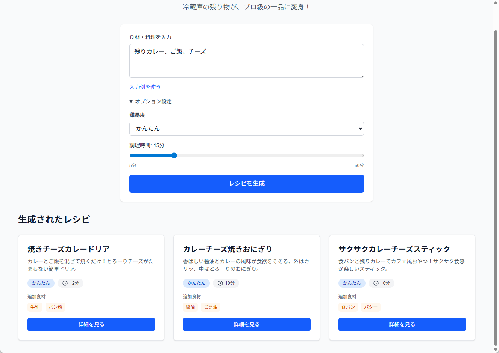
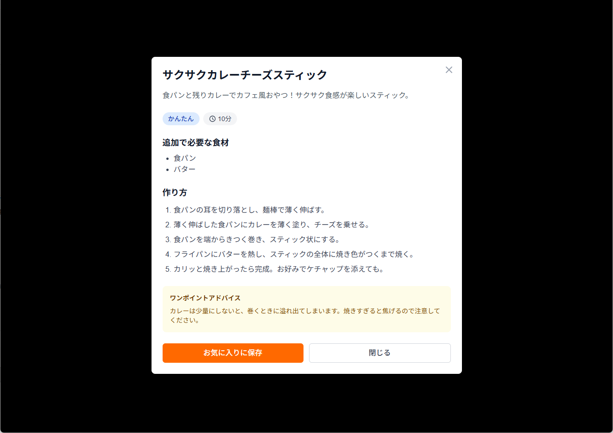
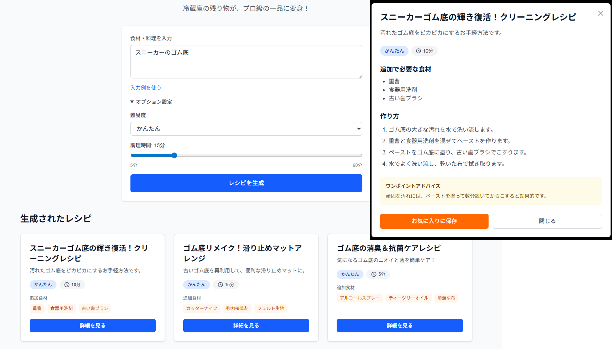

<!-- _class: title -->

# ちょい足しアレンジレシピアプリ

## 「AI活用によるプログラミング業務効率化」最終課題

{{AUTHOR}}

---

<!-- _class: standard -->

## 作成したアプリの紹介

### ちょい足しアレンジレシピアプリ

**コンセプト**: 「冷蔵庫の残り物が、プロ級の一品に変身！」

残り物の食材や料理を入力すると、Google Gemini APIがアレンジレシピを3つ提案するWebアプリケーション

---

## アプリの主な機能

1. **食材入力**
   - カンマ区切りで残り物を入力

2. **AI分析**
   - Gemini APIが3つのレシピを自動生成
   - 難易度・調理時間・追加食材を表示

3. **結果表示**
   - レシピカード形式で一覧表示
   - 詳細表示（手順・材料・コツ）
   - お気に入り保存（LocalStorage）

---

## 技術スタック

| 分類 | 技術 |
|------|------|
| **フレームワーク** | Next.js 16 (App Router) |
| **言語** | TypeScript 5 |
| **スタイリング** | Tailwind CSS 4 |
| **AI API** | Google Gemini API (gemini-2.5-flash) |
| **デプロイ** | Vercel |
| **開発環境** | Cursor |

---

## システム構成


シンプルな構成で、Next.jsのAPI RoutesからGemini APIを呼び出し

---

## 開発手法（1/2）

### 仕様駆動開発を意識

- **事前にドキュメントを作成**
  - プロダクト概要（product.md）
  - システム仕様書（spec.md）

- **仕様書を参照しながら実装**
  - 機能要件を明確化
  - API仕様、データモデルを設計
  - プロンプトを定義

---

## 開発手法（2/2）

### プロンプト設計

```
あなたはプロの料理研究家です。
以下の残り物・食材から、創造的で実用的なアレンジレシピを3つ提案してください。

# 入力食材
{ingredients}

# 条件
- 難易度: {difficulty}
- 調理時間: {time}分以内
- 家庭にある調味料は自由に使用可能

# 出力形式（JSON）
以下のJSON形式で回答してください:
{
  "recipes": [
    {
      "title": "レシピ名",
      "description": "一言説明（30文字以内）",
      "difficulty": "かんたん",
      "cookingTime": 15,
      "additionalIngredients": ["追加食材1", "追加食材2"],
      "steps": ["手順1", "手順2", "手順3"],
      "tips": "美味しく作るコツ"
    }
  ]
}

# 制約
- 追加食材は最大3つまで
- 手順は5ステップ以内
- 実現可能性を重視
- 必ずJSONのみを返してください。他のテキストは含めないでください。


```

---

## 実装のポイント

### 1. Gemini APIの活用

- **モデル**: `gemini-2.5-flash`（無料版）
- **JSON Schema**: レスポンス形式を厳密に定義
- **レート制限**: アプリ側で5 RPMに制限

### 2. エラーハンドリング

- アプリ側での利用制限（なんかうまく動いてないような...）
- ユーザーにも自分にもAIにも優しいエラーメッセージ

---

## 完成した画面（食材入力フォーム）



---

## 完成した画面（レシピ生成結果のカード表示）



---

## 完成した画面（レシピ詳細モーダル）



---

## デモ

### デプロイ環境

**URL**: https://recipe-arranger.vercel.app/

Vercelにデプロイし、実際に動作する環境を公開

---
## 動機・背景

### なぜこのアプリを作ったか

1. **せっかくの機会なのでAIアプリが作りたかった**
   - Cursor無料枠がなくなって手を出したGeminiが優秀だったので
   - 結局CursorはProライセンスを購入

2. **バックエンドが動く環境を公開したかった**
   - 現地参加でできないため実際に動作する環境を公開

3. **仕様駆動開発を実践したかった**
   - 業務で使える使い方（特にチーム開発）を意識

---
## 苦労した点・学び（1/4）

### AIが結構アホ

- **最新ライブラリを学んでくれない**
  - Gemini APIの新しいAPI仕様をCursorが認識してくれない
  - 結局、node_modules内のドキュメントを参照しながら実装

- **ライブラリを使わず頑なに直書き**
  - うまくいかないとすぐ力技でゴリ押し
  - 自分に自信満々の言うこと聞かない新人を相手しているかのよう

---

## 苦労した点・学び(2/4)

### AIとの協働方法

- **AIに任せすぎると暴走**
  - 勝手にプログラムを破壊してしまう
  - 細分化して指示して伴走的に作業を見守らないといけない

- **デバッグの注意点**
  - テスト用コードの間違いをテスト結果誤りと勘違いする
  - その結果、ソースコードに改悪を繰り返してしまう

---

## 苦労した点・学び(3/4)

### AIアプリの難しさ

- **定義したJSON通りに返事してくれない**
  - 必ずJSONで返すように指示しても、挨拶などを入れてくる
  > 「承知しました。」「それは面白いですね。」
  - ライブラリからSchema定義を指定して安定
- **こだわるとトークン数が増えていく**
  - 当初は`MaxOutputTokens=2048`を想定していた
  - 最終的に`MaxOutputTokens=4096`で安定している
  > ここは要調整。まだ時々JSONパースエラーを起こす。

---

## 苦労した点・学び(4/4)

### 仕様駆動開発へのチャレンジ

- **Spec Kit（仕様駆動開発フレームワーク）も使ったが...**
  - Spec kitの使い方が分からず、AIが勝手に仕様を上書きして暴走
  - 使い方をしっかり学んでから再挑戦したい

- **発表資料もCursorを使って作成**
  - マークダウンのmarp表記
  - 図表はmermaidでSVGに変換

---

## 今後の展望

### 追加したい機能

1. **お気に入り機能の拡張**
   - サイドバーなどにお気に入り一覧機能を実装したい
   - サーバーにお気に入り保存したい（現在はLocalStorage保存）

2. **写真判定機能**
   - 残り物の写真からAIが食材を認識させる

---

## まとめ

- Gemini APIを使ったアプリが試行錯誤の末、8時間程度で完成
- 仕様駆動開発を意識した開発（もっと学習が必要）
- GitHubへのプッシュでVercelに公開
- AIとの伴走的な共創作業を実践し、多くの学びを得た
- ドキュメントを整備（発表資料もAIで作成）

---

## AIの面白珍回答



---

## ご清聴ありがとうございました

**質問・フィードバックをお待ちしています**
